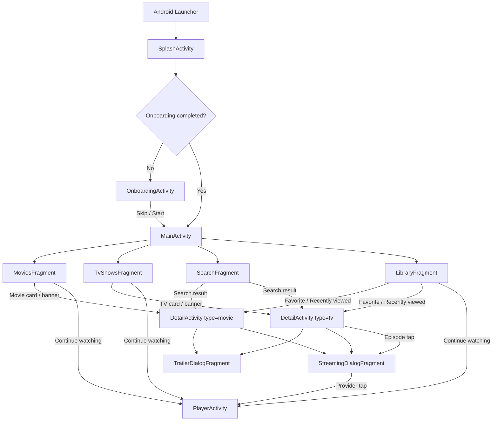
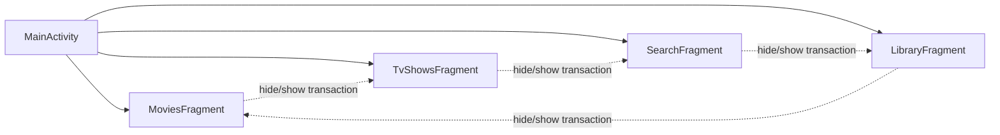
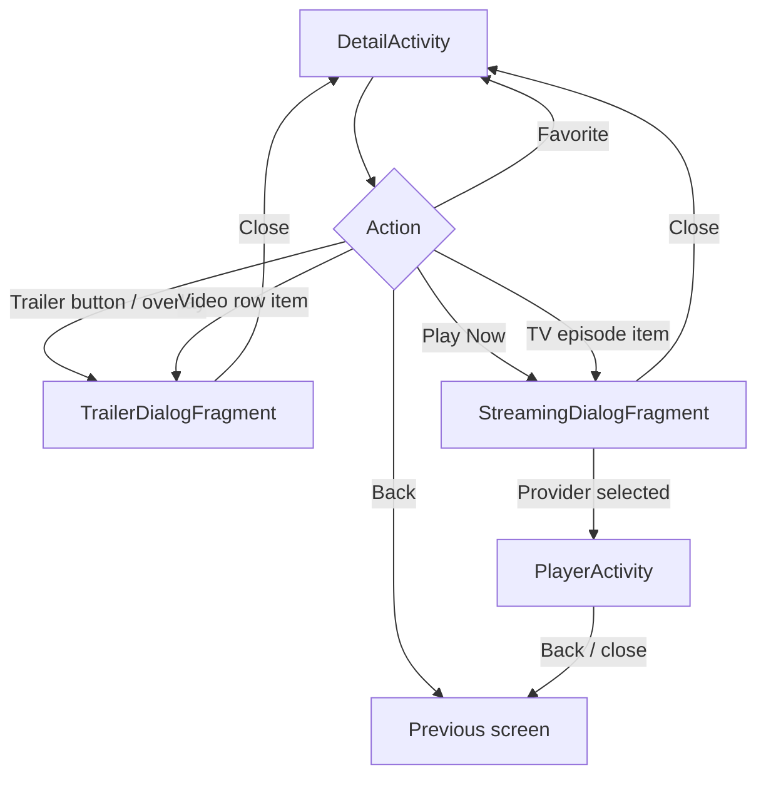
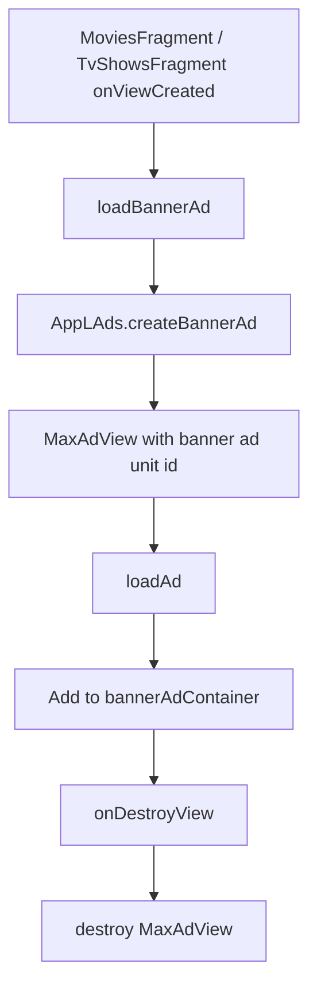
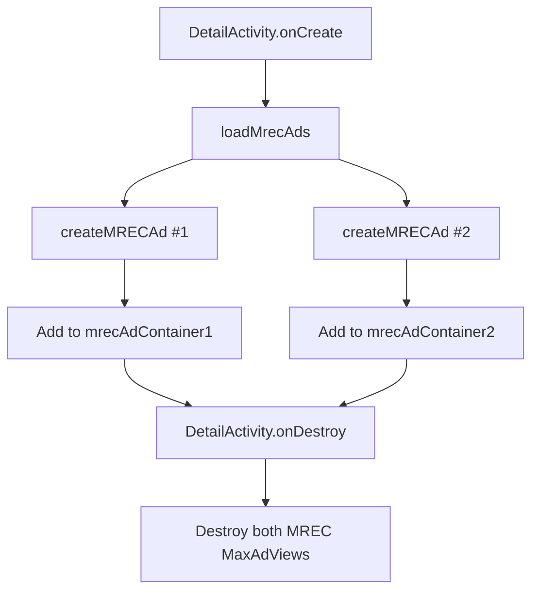
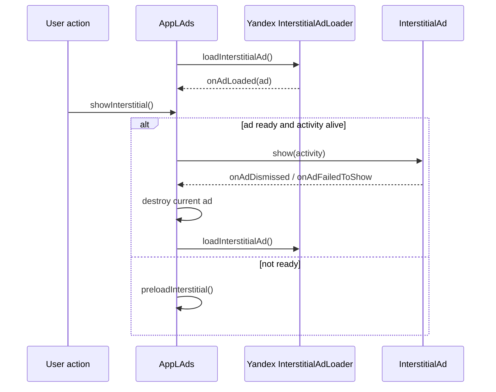
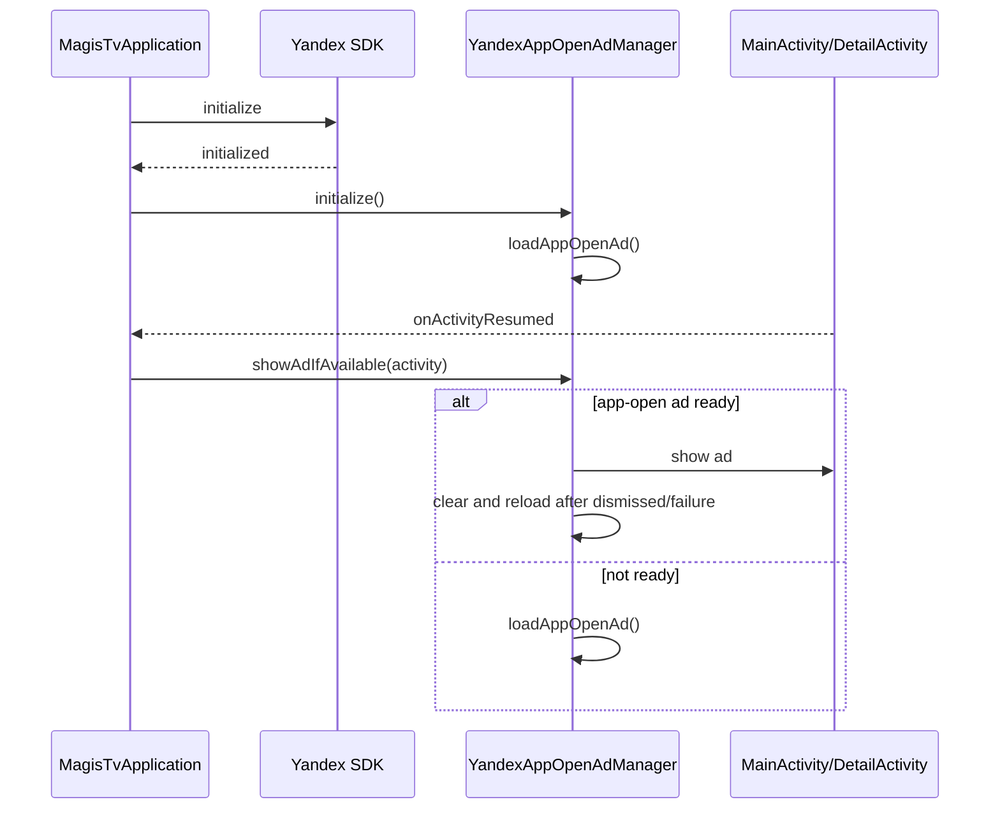
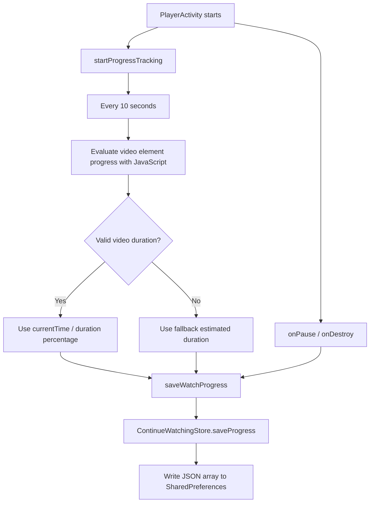
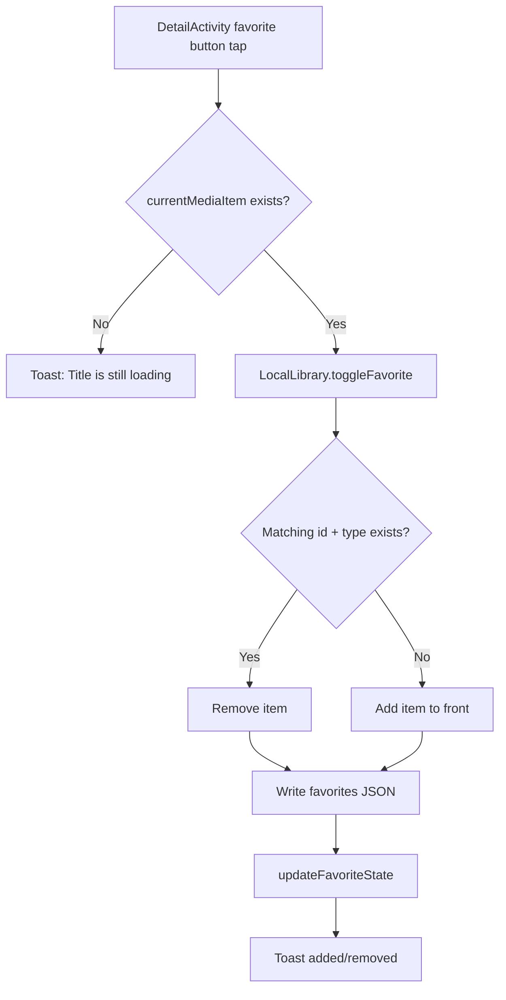
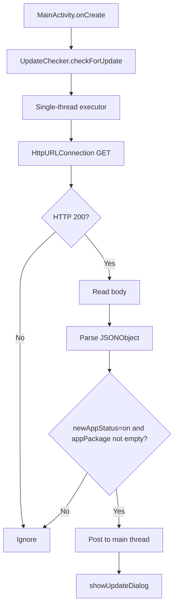

# Java App Logic Analysis - Flutter Migration Specification

Source document: `JAVA_APP_LOGIC.md`.

This specification reverse-engineers the current Java Android app behavior for a future Flutter migration. It does not generate Flutter code, change business logic, redesign UI, remove behavior, or propose architectural improvements.

## 1. App Overview

### Purpose

The application is a movie and TV discovery and streaming shell. It uses TMDB for metadata, lists, search, details, trailers, cast, providers, similar titles, and TV episode data. Actual playback is not served by TMDB; playback URLs are generated with TMDB ids and loaded through `https://vsembed.ru/` in a WebView.

The visible app name is `Lumina Tv`. The Java package is `com.freewatching.magistv4`. The Android application id is `com.onstreamtv.tvonstream`.

### User journey

1. Android launches `SplashActivity`.
2. `SplashActivity` checks whether onboarding has already been completed.
3. First-time users go to `OnboardingActivity`; returning users go to `MainActivity`.
4. `MainActivity` shows the Movies tab by default and hosts Movies, TV Shows, Search, and Library.
5. Users browse movie/TV shelves, search, or open saved library items.
6. Tapping a title attempts an interstitial ad and opens `DetailActivity`.
7. `DetailActivity` loads metadata, trailer/video data, watch providers, cast, similar titles, and TV episodes when applicable.
8. Users can favorite a title, play a trailer, or open the streaming provider selector.
9. `StreamingDialogFragment` displays available providers and opens `PlayerActivity` after provider selection.
10. `PlayerActivity` loads the stream in a fullscreen WebView and periodically saves continue-watching progress.

### Main screens

- Splash: launch router.
- Onboarding: three-page first-run introduction.
- Main: app shell with drawer and bottom navigation.
- Movies: movie home shelves.
- TV Shows: TV home shelves.
- Search: debounced TMDB search.
- Library: favorites, continue watching, recently viewed.
- Detail: title metadata, trailers, providers, cast, similar titles, TV seasons/episodes.
- Trailer dialog: fullscreen YouTube WebView.
- Streaming dialog: bottom-sheet provider selector.
- Player: fullscreen WebView player.

### Core features

- TMDB-backed Movies and TV Shows shelves.
- Search by Movies or TV Shows.
- Detail pages for movies and TV shows.
- YouTube trailer playback in WebView dialog.
- Provider display from TMDB watch-provider responses.
- External stream playback through generated `vsembed.ru` URLs.
- Continue-watching tracking.
- Favorites.
- Recently viewed titles.
- Offline state view and retry behavior.
- AppLovin MAX banner/MREC/reward/native helpers.
- Yandex interstitial and app-open ads.
- GitHub-hosted forced update JSON check.

## 2. Navigation Flow

### Primary navigation diagram



### MainActivity tab navigation



### Detail, trailer, streaming, and player navigation



### Explicit navigation paths

| From | Trigger | To | Data passed |
| --- | --- | --- | --- |
| Android launcher | App launch | `SplashActivity` | None |
| `SplashActivity` | Onboarding complete | `MainActivity` | None |
| `SplashActivity` | Onboarding not complete | `OnboardingActivity` | None |
| `OnboardingActivity` | Skip or Start | `MainActivity` | Clears task |
| `MainActivity` | Bottom nav Movies | `MoviesFragment` | Existing fragment shown |
| `MainActivity` | Bottom nav TV Shows | `TvShowsFragment` | Existing fragment shown |
| `MainActivity` | Bottom nav Search | `SearchFragment` | Existing fragment shown, interstitial attempted |
| `MainActivity` | Bottom nav Library | `LibraryFragment` | Existing fragment shown |
| `MoviesFragment` | Movie card/banner | `DetailActivity` | `id`, `type=movie` |
| `TvShowsFragment` | TV card/banner | `DetailActivity` | `id`, `type=tv` |
| `SearchFragment` | Movie result | `DetailActivity` | `id`, `type=movie` |
| `SearchFragment` | TV result | `DetailActivity` | `id`, `type=tv` |
| `LibraryFragment` | Favorite/recent item | `DetailActivity` | `id`, `type` |
| Movies/TV/Library | Continue watching item | `PlayerActivity` | Playback/progress extras |
| `DetailActivity` | Trailer button/overlay or video row | `TrailerDialogFragment` | `video_key`, `video_name` |
| `DetailActivity` | Play Now | `StreamingDialogFragment` | id, type, title, providers, poster/backdrop |
| `DetailActivity` | TV episode row | `StreamingDialogFragment` | id, type, episode title, providers, season, episode, poster/backdrop |
| `StreamingDialogFragment` | Provider tap | `PlayerActivity` | generated video URL and metadata |
| `PlayerActivity` | Back/toolbar close | Previous activity | Saves progress during teardown |

## 3. Screen-by-Screen Analysis

### Splash

- Purpose: Route the app to onboarding or main screen.
- Entry points: Android launcher.
- Inputs: `OnboardingPreferences.isCompleted(context)`.
- Data loaded: Boolean onboarding completion flag.
- API calls used: None.
- Local storage used: Reads `magis_tv_onboarding/onboarding_complete`.
- Ads shown: None directly.
- User actions: None; route happens immediately.
- Navigation outputs:
  - `OnboardingActivity` if onboarding is not complete.
  - `MainActivity` if onboarding is complete.

### Onboarding

- Purpose: First-run introduction with three cinematic pages.
- Entry points: `SplashActivity` when onboarding is incomplete.
- Inputs: String resources and hardcoded TMDB image URLs.
- Data loaded: Three `OnboardingPage` objects.
- API calls used: None through Retrofit; images are loaded by Glide from TMDB image URLs.
- Local storage used: Writes onboarding completion.
- Ads shown: None.
- User actions:
  - Skip.
  - Next.
  - Start.
  - Back to previous page or normal back.
- Navigation outputs:
  - `MainActivity` with `NEW_TASK | CLEAR_TASK` after completion.

### Main

- Purpose: Main shell for app navigation, drawer actions, app-level ad initialization, and update checking.
- Entry points:
  - `SplashActivity`.
  - `OnboardingActivity` after completion.
- Inputs: None through intent.
- Data loaded:
  - Creates four fragments.
  - Initializes ad systems.
  - Starts remote update check.
- API calls used: None to TMDB directly.
- Local storage used: None directly.
- Ads shown:
  - Initializes AppLovin.
  - Initializes Yandex interstitial pipeline.
  - Yandex app-open ads may show through application lifecycle when resumed.
  - Interstitial attempted when Search tab is selected or reselected.
- User actions:
  - Switch bottom navigation tabs.
  - Open drawer.
  - Rate app.
  - View privacy/about dialogs.
  - Open contact mail chooser.
  - Press back.
- Navigation outputs:
  - Shows Movies, TV Shows, Search, or Library fragments.
  - External Play Store page for Rate.
  - External email chooser for Contact.

### Movies

- Purpose: Movie discovery home.
- Entry points: Default visible fragment in `MainActivity`; bottom nav Movies.
- Inputs: None through arguments.
- Data loaded:
  - Continue-watching list from local storage.
  - Now-playing movies for banner.
  - Trending movies.
  - Popular movies.
  - Top rated movies.
  - Upcoming movies.
- API calls used:
  - `GET movie/now_playing`
  - `GET trending/movie/day`
  - `GET movie/popular`
  - `GET movie/top_rated`
  - `GET movie/upcoming`
- Local storage used:
  - Reads `ContinueWatchingStore.getContinueWatching()`.
- Ads shown:
  - AppLovin banner in `bannerAdContainer`.
  - Interstitial attempt on movie card/banner click.
- User actions:
  - Pull to refresh.
  - Tap movie card.
  - Tap banner.
  - Tap continue-watching item.
- Navigation outputs:
  - `DetailActivity` with `id` and `type=movie`.
  - `PlayerActivity` for continue-watching item.

### TV Shows

- Purpose: TV discovery home.
- Entry points: Bottom nav TV Shows.
- Inputs: None through arguments.
- Data loaded:
  - Continue-watching list from local storage.
  - Airing today TV shows for banner.
  - Trending TV.
  - Popular TV.
  - Top rated TV.
  - On the air TV.
- API calls used:
  - `GET tv/airing_today`
  - `GET trending/tv/day`
  - `GET tv/popular`
  - `GET tv/top_rated`
  - `GET tv/on_the_air`
- Local storage used:
  - Reads `ContinueWatchingStore.getContinueWatching()`.
- Ads shown:
  - AppLovin banner in `bannerAdContainer`.
  - Interstitial attempt on TV card/banner click.
- User actions:
  - Pull to refresh.
  - Tap TV card.
  - Tap banner.
  - Tap continue-watching item.
- Navigation outputs:
  - `DetailActivity` with `id` and `type=tv`.
  - `PlayerActivity` for continue-watching item.

### Search

- Purpose: Search TMDB movies or TV shows.
- Entry points: Bottom nav Search; Search tab reselection.
- Inputs:
  - Text query from `EditText`.
  - Selected tab, `movie` or `tv`.
- Data loaded:
  - Search results for the active tab.
- API calls used:
  - `GET search/movie`
  - `GET search/tv`
- Local storage used: None.
- Ads shown:
  - Interstitial attempted when Search tab is selected/reselected in `MainActivity`.
  - Interstitial attempted when result item is tapped.
- User actions:
  - Type query.
  - Submit IME search.
  - Switch Movies/TV Shows tab.
  - Tap result.
  - Retry offline state.
- Navigation outputs:
  - `DetailActivity` with `id`, `type=movie`.
  - `DetailActivity` with `id`, `type=tv`.

### Library

- Purpose: Display local user shelves.
- Entry points: Bottom nav Library.
- Inputs: Locally stored favorites, continue-watching progress, recently viewed items.
- Data loaded:
  - Favorites from `LocalLibrary`.
  - Continue watching from `ContinueWatchingStore`.
  - Recently viewed from `LocalLibrary`.
- API calls used: None.
- Local storage used:
  - Reads `magis_tv_local_library/favorites`.
  - Reads `magis_tv_local_library/recently_viewed`.
  - Reads `magis_tv_continue_watching/continue_watching_progress`.
- Ads shown:
  - Interstitial attempted when a favorite/recently viewed item is tapped.
  - No interstitial for continue-watching resume.
- User actions:
  - Tap favorite.
  - Tap recently viewed.
  - Tap continue-watching resume.
- Navigation outputs:
  - `DetailActivity` for favorites and recently viewed.
  - `PlayerActivity` for continue watching.

### Detail

- Purpose: Show movie or TV metadata and actions.
- Entry points:
  - Movie/TV/banner cards.
  - Search results.
  - Favorites.
  - Recently viewed.
- Inputs:
  - Intent extra `id`.
  - Intent extra `type`.
- Data loaded:
  - Detail metadata.
  - Videos/trailers.
  - Credits/cast.
  - Watch providers.
  - Similar titles.
  - TV season episodes after TV detail returns.
- API calls used for movies:
  - `GET movie/{movie_id}`
  - `GET movie/{movie_id}/videos`
  - `GET movie/{movie_id}/credits`
  - `GET movie/{movie_id}/watch/providers`
  - `GET movie/{movie_id}/similar`
- API calls used for TV:
  - `GET tv/{tv_id}`
  - `GET tv/{tv_id}/videos`
  - `GET tv/{tv_id}/credits`
  - `GET tv/{tv_id}/watch/providers`
  - `GET tv/{tv_id}/similar`
  - `GET tv/{tv_id}/season/{season_number}`
- Local storage used:
  - Writes recently viewed through `LocalLibrary.addRecentlyViewed()`.
  - Reads/toggles favorites through `LocalLibrary`.
  - Reads saved continue-watching progress before opening player.
- Ads shown:
  - Two AppLovin MREC ad views.
  - Interstitial attempt on Play Now.
  - Interstitial attempt on Trailer button.
  - Interstitial attempt on trailer overlay.
- User actions:
  - Back.
  - Toggle favorite.
  - Play Now.
  - Open trailer.
  - Tap video item.
  - Select TV season chip.
  - Tap TV episode.
  - Tap similar title.
- Navigation outputs:
  - `TrailerDialogFragment`.
  - `StreamingDialogFragment`.
  - `DetailActivity` for similar title through Movie/TV adapter.

### Trailer

- Purpose: Play a YouTube trailer or YouTube video in a fullscreen WebView dialog.
- Entry points:
  - Detail Trailer button.
  - Detail trailer overlay.
  - Detail video row.
- Inputs:
  - `video_key`.
  - `video_name`.
- Data loaded:
  - YouTube watch URL in WebView.
- API calls used: None through Retrofit.
- Local storage used: None.
- Ads shown:
  - Interstitial is attempted before opening the trailer from Detail button/overlay.
  - No ad is shown by the dialog itself.
- User actions:
  - Close dialog.
  - Interact with YouTube WebView.
- Navigation outputs:
  - Dismiss back to `DetailActivity`.

### Streaming Dialog

- Purpose: Display available streaming providers and launch playback.
- Entry points:
  - Detail Play Now.
  - TV episode tap.
- Inputs:
  - Item id.
  - Item type.
  - Item title.
  - Provider list.
  - Season number.
  - Episode number.
  - Poster path.
  - Backdrop path.
- Data loaded:
  - No network data loaded directly.
  - Uses provider list already loaded by `DetailActivity`.
- API calls used: None.
- Local storage used:
  - Reads saved progress from `ContinueWatchingStore.getItem()` before opening player.
- Ads shown:
  - Interstitial attempted when provider is tapped.
- User actions:
  - Close.
  - Select provider.
- Navigation outputs:
  - `PlayerActivity` with generated `vsembed.ru` URL and progress extras.

### Player

- Purpose: Load the generated stream URL in a fullscreen WebView and track progress.
- Entry points:
  - `StreamingDialogFragment` provider tap.
  - `ContinueWatchingAdapter` resume tap.
- Inputs:
  - `video_url`.
  - `item_id`.
  - `item_type`.
  - `item_title`.
  - `episode_title`.
  - `poster_path`.
  - `backdrop_path`.
  - `season`.
  - `episode`.
  - `progress_percentage`.
- Data loaded:
  - WebView loads stream URL.
  - If URL is absent but item id exists, URL is generated from id/type/season/episode.
  - Saved progress may be loaded from `ContinueWatchingStore`.
- API calls used: None through Retrofit.
- Local storage used:
  - Reads saved progress.
  - Writes progress every 10 seconds, on pause, and on destroy.
- Ads shown: None directly.
- User actions:
  - Touch screen to show controls.
  - Tap content to toggle toolbar.
  - Toolbar close/back.
  - System back.
- Navigation outputs:
  - Finish back to previous activity.

## 4. TMDB API Mapping

| Endpoint | Retrofit method | Parameters | Response model | Screens using it | Purpose |
| --- | --- | --- | --- | --- | --- |
| `GET discover/movie` | `discoverMovies` | `api_key`, `with_genres`, `page` | `MovieResponse` | Not used currently | Declared movie discovery by genre |
| `GET discover/tv` | `discoverTvShows` | `api_key`, `with_genres`, `page` | `TvShowResponse` | Not used currently | Declared TV discovery by genre |
| `GET tv/airing_today` | `getAiringTodayTvShows` | `api_key`, `page` | `TvShowResponse` | TV Shows | TV banner content |
| `GET movie/{movie_id}/credits` | `getMovieCredits` | `movie_id`, `api_key` | `CreditsResponse` | Detail | Movie cast |
| `GET movie/{movie_id}` | `getMovieDetail` | `movie_id`, `api_key` | `MovieDetail` | Detail | Movie metadata |
| `GET movie/{movie_id}/videos` | `getMovieVideos` | `movie_id`, `api_key` | `VideoResponse` | Detail, Trailer flow | Movie trailers/videos |
| `GET movie/{movie_id}/watch/providers` | `getMovieWatchProviders` | `movie_id`, `api_key` | `WatchProviderResponse` | Detail, Streaming Dialog | Movie provider lists |
| `GET movie/now_playing` | `getNowPlayingMovies` | `api_key`, `page` | `MovieResponse` | Movies | Movie banner |
| `GET tv/on_the_air` | `getOnTheAirTvShows` | `api_key`, `page` | `TvShowResponse` | TV Shows | On-the-air TV row |
| `GET movie/popular` | `getPopularMovies` | `api_key`, `page` | `MovieResponse` | Movies | Popular movie row |
| `GET tv/popular` | `getPopularTvShows` | `api_key`, `page` | `TvShowResponse` | TV Shows | Popular TV row |
| `GET movie/{movie_id}/recommendations` | `getRecommendedMovies` | `movie_id`, `api_key`, `page` | `MovieResponse` | Not used currently | Declared movie recommendations |
| `GET tv/{tv_id}/recommendations` | `getRecommendedTvShows` | `tv_id`, `api_key`, `page` | `TvShowResponse` | Not used currently | Declared TV recommendations |
| `GET movie/{movie_id}/similar` | `getSimilarMovies` | `movie_id`, `api_key`, `page` | `MovieResponse` | Detail | Similar movie row |
| `GET tv/{tv_id}/similar` | `getSimilarTvShows` | `tv_id`, `api_key`, `page` | `TvShowResponse` | Detail | Similar TV row |
| `GET movie/top_rated` | `getTopRatedMovies` | `api_key`, `page` | `MovieResponse` | Movies | Top rated movie row |
| `GET tv/top_rated` | `getTopRatedTvShows` | `api_key`, `page` | `TvShowResponse` | TV Shows | Top rated TV row |
| `GET movie/trending/day` | `getTrendingMovies` | `api_key`, `page` | `MovieResponse` | Not used currently | Declared trending movie method |
| `GET trending/movie/day` | `getTrendingMoviesDay` | `api_key`, `page` | `MovieResponse` | Movies | Trending movie row |
| `GET trending/movie/week` | `getTrendingMoviesWeek` | `api_key`, `page` | `MovieResponse` | Not used currently | Declared weekly movie trending |
| `GET trending/tv/day` | `getTrendingTvDay` | `api_key`, `page` | `TvShowResponse` | TV Shows | Trending TV row |
| `GET trending/tv/week` | `getTrendingTvWeek` | `api_key`, `page` | `TvShowResponse` | Not used currently | Declared weekly TV trending |
| `GET tv/{tv_id}/season/{season_number}` | `getTvSeasonDetail` | `tv_id`, `season_number`, `api_key` | `SeasonResponse` | Detail | TV episode list |
| `GET tv/{tv_id}/credits` | `getTvShowCredits` | `tv_id`, `api_key` | `CreditsResponse` | Detail | TV cast |
| `GET tv/{tv_id}` | `getTvShowDetail` | `tv_id`, `api_key` | `TvShowDetail` | Detail | TV metadata |
| `GET tv/{tv_id}/videos` | `getTvShowVideos` | `tv_id`, `api_key` | `VideoResponse` | Detail, Trailer flow | TV trailers/videos |
| `GET tv/{tv_id}/watch/providers` | `getTvShowWatchProviders` | `tv_id`, `api_key` | `WatchProviderResponse` | Detail, Streaming Dialog | TV provider lists |
| `GET movie/upcoming` | `getUpcomingMovies` | `api_key`, `page` | `MovieResponse` | Movies | Upcoming movie row |
| `GET search/movie` | `searchMovies` | `api_key`, `query`, `page` | `MovieResponse` | Search | Movie search results |
| `GET search/tv` | `searchTvShows` | `api_key`, `query`, `page` | `TvShowResponse` | Search | TV search results |

## 5. Data Models

| Model | Fields | Usage | Screens | Storage |
| --- | --- | --- | --- | --- |
| `Movie` | `adult`, `backdropPath`, `genreIds`, `id`, `originalLanguage`, `overview`, `popularity`, `posterPath`, `releaseDate`, `title`, `voteAverage`, `voteCount` | Movie list/search/similar row item; builds full poster/backdrop URLs | Movies, Search, Detail similar, banners | Not persisted directly |
| `MovieDetail` | `backdropPath`, `budget`, `genres`, `id`, `originalLanguage`, `overview`, `posterPath`, `releaseDate`, `revenue`, `runtime`, `status`, `tagline`, `title`, `voteAverage`, `voteCount` | Full movie metadata; computes year, genre string, formatted runtime, full image URLs | Detail | Converted to `LocalMediaItem` for recently viewed/favorites |
| `MovieResponse` | `page`, `results`, `totalPages`, `totalResults` | TMDB paged movie wrapper | Movies, Search, Detail similar | Not persisted |
| `TvShow` | `backdropPath`, `firstAirDate`, `genreIds`, `id`, `name`, `originalLanguage`, `overview`, `popularity`, `posterPath`, `voteAverage`, `voteCount` | TV list/search/similar row item; builds full poster/backdrop URLs | TV Shows, Search, Detail similar, banners | Not persisted directly |
| `TvShowDetail` | `backdropPath`, `episodeRunTime`, `firstAirDate`, `genres`, `id`, `lastAirDate`, `name`, `numberOfEpisodes`, `numberOfSeasons`, `originalLanguage`, `overview`, `posterPath`, `status`, `tagline`, `voteAverage`, `voteCount` | Full TV metadata; computes year, genre string, seasons info, full image URLs | Detail | Converted to `LocalMediaItem` for recently viewed/favorites |
| `TvShowResponse` | `page`, `results`, `totalPages`, `totalResults` | TMDB paged TV wrapper | TV Shows, Search, Detail similar | Not persisted |
| `Genre` | `id`, `name` | Detail genre display | Detail | Nested in detail models only |
| `Cast` | `character`, `id`, `name`, `order`, `profilePath` | Cast row; builds full profile URL | Detail | Not persisted |
| `CreditsResponse` | `cast`, `id` | Credits wrapper | Detail | Not persisted |
| `Video` | `id`, `key`, `name`, `official`, `site`, `type` | Trailer/video row; detects YouTube and trailer type; builds YouTube thumbnail URL | Detail, Trailer | Not persisted |
| `VideoResponse` | `id`, `results` | Videos wrapper | Detail | Not persisted |
| `WatchProvider` | `displayPriority`, `logoPath`, `providerId`, `providerName` | Provider rows and streaming dialog grid; builds logo URL; serializable for Bundle passing | Detail, Streaming Dialog | Passed in memory through fragment arguments, not SharedPreferences |
| `WatchProviderResponse` | `id`, `results` map | Provider country wrapper | Detail | Not persisted |
| `CountryProviders` | `ads`, `buy`, `flatrate`, `link`, `rent` | Provider grouping for selected country | Detail | Not persisted |
| `Episode` | `airDate`, `episodeNumber`, `id`, `name`, `overview`, `runtime`, `seasonNumber`, `stillPath`, `voteAverage` | TV episode row; builds still URL | Detail, Streaming Dialog | Episode number/season stored in `WatchProgressItem` when watched |
| `SeasonResponse` | `episodes`, `id`, `name`, `overview`, `seasonNumber` | TV season wrapper | Detail | Not persisted |
| `LocalMediaItem` | `backdropUrl`, `id`, `lastUpdated`, `posterUrl`, `rating`, `subtitle`, `title`, `type` | Favorites and recently viewed item | Detail, Library | Stored as JSON in `magis_tv_local_library` |
| `WatchProgressItem` | `backdropPath`, `episodeNumber`, `lastWatchedTimestamp`, `posterPath`, `progressPercentage`, `seasonNumber`, `title`, `tmdbId`, `type`, `videoUrl` | Continue-watching item and player resume data | Movies, TV Shows, Library, Streaming Dialog, Player | Stored as JSON in `magis_tv_continue_watching` |
| `LocalMediaItem` library list | Same as `LocalMediaItem` | List entry in favorites/recently viewed | Library | JSON arrays |
| `OnboardingPage` | `title`, `subtitle`, `backgroundImageUrl` | Onboarding ViewPager item | Onboarding | Not persisted |

### Model-to-screen notes

- `Movie` and `TvShow` are list-level models.
- `MovieDetail` and `TvShowDetail` are detail-level models and are the source for local `LocalMediaItem` creation.
- `WatchProviderResponse` is processed in `DetailActivity` and reduced to display lists plus `allProviders`.
- `VideoResponse` is filtered down to YouTube videos only.
- `WatchProgressItem` is the only model that represents playback progress and episode-specific resume state.

## 6. Local Storage Mapping

| Preference file | Key | Data type | Read locations | Write locations |
| --- | --- | --- | --- | --- |
| `magis_tv_onboarding` | `onboarding_complete` | Boolean | `SplashActivity` through `OnboardingPreferences.isCompleted()` | `OnboardingActivity.finishOnboarding()` through `OnboardingPreferences.setCompleted()` |
| `magis_tv_continue_watching` | `continue_watching_progress` | Gson JSON array of `WatchProgressItem` | Movies, TV Shows, Library, Streaming Dialog, Player | `PlayerActivity.saveWatchProgress()` through `ContinueWatchingStore.saveProgress()` |
| `magis_tv_local_library` | `favorites` | Gson JSON array of `LocalMediaItem` | `DetailActivity.updateFavoriteState()`, `LibraryFragment.refreshLibrary()` | `DetailActivity.toggleFavorite()` through `LocalLibrary.toggleFavorite()` |
| `magis_tv_local_library` | `recently_viewed` | Gson JSON array of `LocalMediaItem` | `LibraryFragment.refreshLibrary()` | `DetailActivity.displayMovieDetail()`, `DetailActivity.displayTvShowDetail()` through `LocalLibrary.addRecentlyViewed()` |
| `magis_tv_local_library` | `continue_watching` | Gson JSON array of `LocalMediaItem` | No current UI read path for actual continue watching | `LocalLibrary.addContinueWatching()` exists but current flow uses `ContinueWatchingStore` instead |

### Storage behavior

- Onboarding stores one boolean flag.
- Favorites and recently viewed store up to 24 `LocalMediaItem` records.
- Continue watching stores up to 20 `WatchProgressItem` records.
- Corrupt JSON in local lists is caught and the affected key is removed.
- TMDB network responses are not cached in SharedPreferences.

## 7. Ads Architecture

### AppLovin integration

- Manifest contains AppLovin SDK key metadata.
- `MainActivity.onCreate()` calls `AppLAds.initializeSDK(this, callback)`.
- `AppLAds.initializeSDK()` gets the AppLovin SDK instance and initializes it with MAX mediation provider.
- The callback calls `AppLAds.initializeAds(this)`.
- `initializeAds()` initializes rewarded ads and starts Yandex interstitial initialization/loading.

### Yandex integration

- `MagisTvApplication` initializes Yandex SDK at application startup.
- `AppLAds.initializeYandexSDK()` handles repeated initialization calls by queuing callbacks.
- Yandex supplies:
  - Interstitial ads through `InterstitialAdLoader`.
  - App-open ads through `YandexAppOpenAdManager`.

### Banner flow



### MREC flow



### Interstitial flow



Interstitial trigger points:

- Search tab select/reselect.
- Movie/TV/banner/search/library item taps.
- Detail Play Now.
- Detail Trailer button/overlay.
- Provider selection in `StreamingDialogFragment`.

### App-open flow



### Reward/native helpers

`AppLAds` contains reward and native ad helpers. The current documented app flow does not call them.

## 8. Continue Watching System

### Save flow



### Resume flow

1. User taps a continue-watching item or selects a streaming provider with existing progress.
2. `PlayerActivity` receives progress through intent extras or reads it from `ContinueWatchingStore`.
3. WebView loads the playback URL.
4. `onPageFinished()` calls `restorePlaybackPosition()`.
5. JavaScript seeks the first video element to the saved percentage.
6. If no video element is available yet, the script retries up to 20 times.

### Progress calculation

- Preferred calculation: JavaScript reads the page's first `<video>` element.
- If `duration` is valid, progress is `currentTime / duration * 100`.
- Result is clamped from 1 to 99.
- Fallback calculation uses elapsed session time:
  - Movie estimated duration: 120 minutes.
  - TV estimated duration: 45 minutes.
- Fallback result is clamped from 1 to 94.
- Saved progress does not decrease when a higher existing value is present.

### Storage structure

Preference file: `magis_tv_continue_watching`

Key: `continue_watching_progress`

Stored item: `WatchProgressItem`

Stored fields:

- `tmdbId`
- `title`
- `posterPath`
- `backdropPath`
- `type`
- `videoUrl`
- `seasonNumber`
- `episodeNumber`
- `progressPercentage`
- `lastWatchedTimestamp`

### Removal rules

- Completed threshold is 95 percent.
- Items with progress greater than or equal to 95 percent are not kept.
- Visible continue-watching list only includes progress greater than 0 and less than 95.
- Maximum stored items is 20.
- Saving removes the matching old item, touches timestamp, and inserts the new item at the front.

### Episode handling

- Movie progress is matched by TMDB id, type, season 0, episode 0.
- TV show-level progress can be matched by TMDB id, type, season 0, episode 0.
- TV episode progress is matched by TMDB id, type, season number, and episode number.
- Episode playback URL includes `season` and `episode` query parameters.
- Display title includes season/episode markers when appropriate.

## 9. Favorites System

### Storage

Favorites are stored in:

- Preference file: `magis_tv_local_library`
- Key: `favorites`
- Data type: JSON array of `LocalMediaItem`
- Max items: 24

### Toggle flow



### UI updates

- Detail favorite button shows outline icon when not favorited.
- Detail favorite button shows filled icon when favorited.
- A small scale animation runs whenever the state is updated.
- Toast text confirms add/remove.

### Library integration

- `LibraryFragment.refreshLibrary()` reads favorites on view creation and resume.
- Favorites section is hidden when empty.
- Favorites are displayed by `LocalMediaAdapter`.
- Tapping a favorite attempts an interstitial and opens `DetailActivity`.

## 10. Update System

### JSON structure

Expected remote JSON:

```json
{
  "newAppStatus": "on",
  "appPackage": "target.package.name"
}
```

Defaults used by code:

- `newAppStatus`: `off`
- `appPackage`: empty string

### Network flow



URL:

- `https://raw.githubusercontent.com/Ayoubdev12/google_play/main/app-update.json`

Network and parse failures are ignored.

### Dialog behavior

- Dialog layout: `dialog_update.xml`.
- Non-cancelable.
- Not canceled by outside touch.
- No later/dismiss action.
- Shows "Update Available" and "Update Now".

### Play Store redirection

When Update Now is tapped:

1. Try `market://details?id=<appPackage>`.
2. If that fails, open `https://play.google.com/store/apps/details?id=<appPackage>`.

There is no version comparison. Remote status controls whether the dialog appears.

## 11. Architecture Mapping For Flutter

No Flutter code is included. This table is only a component equivalence map.

| Current Java Component | Future Flutter Equivalent |
| --- | --- |
| `Application` subclass | App-level bootstrap / lifecycle observer |
| `Activity` | Screen / route |
| `SplashActivity` | Splash route |
| `OnboardingActivity` | Onboarding route |
| `MainActivity` | Main shell route |
| `Fragment` | Page / tab content |
| `MoviesFragment` | Movies tab page |
| `TvShowsFragment` | TV Shows tab page |
| `SearchFragment` | Search tab page |
| `LibraryFragment` | Library tab page |
| `DetailActivity` | Detail route |
| `PlayerActivity` | Player route |
| `DialogFragment` | Dialog route |
| `BottomSheetDialogFragment` | Modal bottom sheet |
| `TrailerDialogFragment` | Fullscreen dialog |
| `StreamingDialogFragment` | Modal bottom sheet |
| `RecyclerView` | ListView / SliverList / horizontal list |
| `ViewPager2` | PageView / carousel-style page view |
| `TabLayout` | Tabs |
| `BottomNavigationView` | Bottom navigation |
| `NavigationView` / `DrawerLayout` | Drawer |
| `SwipeRefreshLayout` | Pull-to-refresh |
| `ChipGroup` / `Chip` | Choice chips |
| `WebView` | WebView plugin view |
| `Glide` | Network image loader |
| `SharedPreferences` | SharedPreferences |
| Gson JSON arrays | JSON serialization |
| `RetrofitClient` | HTTP client / Retrofit-style client |
| `TmdbApi` interface | API service definition |
| `OkHttpClient` timeouts | HTTP client configuration |
| Retrofit `Call.enqueue` | Async request handling |
| `Handler` debounce | Timer/debounce mechanism |
| Android lifecycle callbacks | App lifecycle observer |
| `AppLAds` | Ads service wrapper |
| `YandexAppOpenAdManager` | App-open ad manager |
| AppLovin MAX views | Flutter ad SDK equivalents |
| Yandex interstitial/app-open ads | Flutter Yandex ad SDK equivalents |
| `HttpURLConnection` update check | HTTP GET update check |
| `Intent` extras | Route arguments |
| `Bundle` fragment arguments | Route/modal arguments |
| `Toast` | Toast/snackbar equivalent |
| `MaterialAlertDialogBuilder` | Material dialog |

## 12. Flutter Migration Complexity Report

| Module | Estimate | Reason |
| --- | --- | --- |
| Splash routing | Easy | One boolean local-storage read and route decision. |
| Onboarding | Medium | ViewPager, animated indicators, remote image backgrounds, and completion persistence must match existing flow. |
| Main shell | Medium | Bottom navigation, drawer actions, retained tab state, update check, and ad initialization are all coordinated at startup. |
| Movies tab | Medium | Multiple parallel TMDB calls, banner carousel, indicators, pull refresh, offline state, continue watching, and banner ad container. |
| TV Shows tab | Medium | Same structure as Movies plus TV-specific endpoints. |
| Search | Medium | Requires exact 500 ms debounce, request invalidation, tab switching behavior, offline handling, and result states. |
| Library | Easy | Local-only lists and simple navigation outputs. |
| Detail movie flow | Hard | Multiple parallel API calls, UI sections that appear conditionally, favorites/recently viewed, provider selection, ads, and trailer logic. |
| Detail TV flow | Hard | Includes all detail complexity plus seasons, chips, episode loading, and episode-specific playback. |
| Trailer dialog | Medium | Fullscreen WebView with YouTube navigation behavior and fallback toasts. |
| Streaming dialog | Medium | Provider arguments, grid display, generated playback URLs, saved progress lookup, and player route arguments. |
| Player | Hard | WebView configuration, fullscreen behavior, URL restrictions, JavaScript progress extraction, fallback progress, resume seeking, lifecycle saves. |
| Continue watching | Hard | Progress timing, matching rules, completion removal, episode handling, and WebView interaction must match current behavior. |
| Favorites | Easy | Local JSON list toggling by id/type and UI state update. |
| Recently viewed | Easy | Local JSON insertion when details load. |
| TMDB API layer | Medium | Many endpoints and model mappings, but request behavior is direct. |
| Update checker | Easy | One GET request, JSON parse, forced dialog, external store redirection. |
| AppLovin ads | Hard | Native SDK lifecycle, banner/MREC views, reward/native helpers, and platform view integration. |
| Yandex ads | Hard | Interstitial and app-open lifecycle depend on native SDK behavior and app/activity lifecycle parity. |
| Offline state | Medium | Shared online check, retry callbacks, auto reload on network restoration, and per-screen visibility behavior. |

## 13. Risk Analysis

### Tight couplings

- Activities/fragments call `RetrofitClient.getApi()` directly.
- UI classes directly update adapters after Retrofit callbacks.
- Detail screen owns metadata, favorites, providers, trailer selection, episodes, ads, and navigation.
- Ad calls are embedded in many click handlers.
- `PlayerActivity` combines WebView playback, progress calculation, resume behavior, and local persistence.

### Platform dependencies

- Android `Activity` lifecycle is used for app-open ads and current-activity tracking.
- Android `SharedPreferences` stores all local state.
- Android `WebView` is central to player and trailer behavior.
- Android intent extras carry screen and playback arguments.
- Android dialogs, drawer, bottom navigation, tabs, chips, and RecyclerViews define UI behavior.
- Play Store redirection uses Android market URI fallback.

### WebView dependencies

- Playback depends on `vsembed.ru` pages loading inside WebView.
- Progress depends on JavaScript finding a `<video>` element.
- Resume depends on JavaScript setting `video.currentTime`.
- Player blocks navigation away from URLs that do not contain `https://vsembed.ru/`.
- Player injects JavaScript to click elements containing skip/continue/close text.
- Trailer dialog depends on YouTube watch URLs in WebView.

### Ad SDK dependencies

- AppLovin SDK initializes with MAX mediation.
- AppLovin banner/MREC ads are view-based.
- Yandex interstitial ads use a load/show/destroy/reload lifecycle.
- Yandex app-open ads depend on foreground activity lifecycle.
- Current activity is stored in `AppLAds` through weak references.
- Retry behavior uses exponential backoff for Yandex app-open/interstitial and AppLovin rewarded ads.

### TMDB dependencies

- API key is embedded in `RetrofitClient`.
- All discovery/search/detail data depends on TMDB responses.
- Images depend on TMDB image base URLs and fixed sizes.
- Search, home shelves, details, providers, videos, cast, similar titles, and TV episodes depend on separate TMDB endpoints.
- There is no local cache for TMDB API responses.

### Data and behavior dependencies

- Continue-watching display depends on progress being greater than 0 and less than 95.
- Favorites and recently viewed depend on `LocalMediaItem` generated only after detail data succeeds.
- Provider picker depends on `allProviders` populated by watch-provider response.
- If no providers exist, streaming dialog has no fallback play action.
- Recommendation endpoints exist but are not used by current UI.

## 14. Final Migration Roadmap

This roadmap describes a logic-preserving migration order only.

1. Inventory existing Java routes, fragments, dialogs, models, local keys, endpoints, and ad triggers.
2. Recreate the navigation structure: Splash, Onboarding, Main shell, tabs, Detail, Trailer dialog, Streaming dialog, Player.
3. Recreate model definitions and JSON field mappings.
4. Recreate local storage keys and read/write rules.
5. Recreate TMDB API service mapping with all declared endpoints.
6. Recreate Splash and onboarding routing using the existing completion flag behavior.
7. Recreate Main shell navigation, drawer actions, and fragment/tab retention behavior.
8. Recreate Movies tab data loading, banner, rows, continue watching, refresh, offline state, and ad triggers.
9. Recreate TV Shows tab data loading, banner, rows, continue watching, refresh, offline state, and ad triggers.
10. Recreate Search debounce, tab switching, request invalidation, result states, offline behavior, and result navigation.
11. Recreate Library local shelves and navigation outputs.
12. Recreate Detail movie flow with all parallel calls and conditional sections.
13. Recreate Detail TV flow with all parallel calls, season chips, episode loading, and episode navigation.
14. Recreate trailer selection and fullscreen YouTube WebView behavior.
15. Recreate watch-provider selection and generated `vsembed.ru` playback URL behavior.
16. Recreate Player WebView loading, fullscreen behavior, progress saving, resume seeking, and teardown saves.
17. Recreate continue-watching shelves across Movies, TV Shows, Library, Streaming Dialog, and Player.
18. Recreate favorites and recently viewed behavior.
19. Recreate update-check network flow and forced update dialog.
20. Recreate AppLovin banner/MREC/reward/native helper behavior.
21. Recreate Yandex interstitial and app-open lifecycle behavior.
22. Verify each route, API call, local-storage key, ad trigger, dialog, and playback/progress path against the Java behavior.
